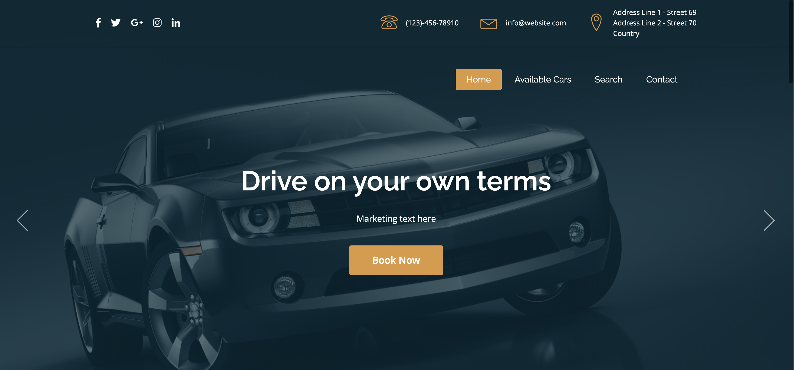
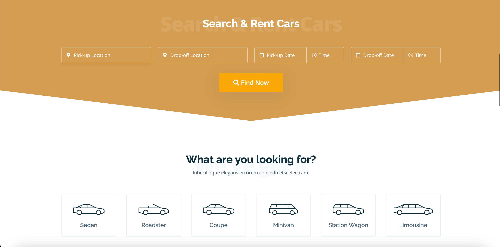
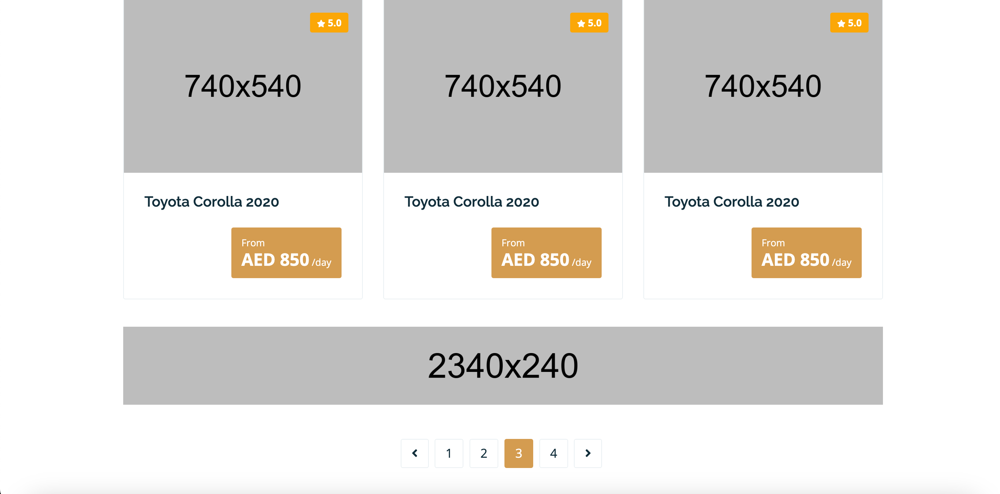

# Laravel Car Rental Demo

Just a demo of a discontinued car rental project I was working on for a client. But I believe it 
demonstrates best practices when it comes to using re-usable Blade components, keeping your controllers 
thin and your models fat, and using Laravel's built-in pagination features.

## Installation

- `git clone wessama/laravel-car-rental-demo`
- `cd laravel-car-rental-demo`
- `composer install`
- `cp .env.example .env`
- `php artisan key:generate`
- `php artisan migrate`
- `php artisan db:seed`

If you want to make use of the auto-complete fields, you'll need to need to provide a value for `GOOGLE_MAPS_API_KEY` in your `.env` file.

Otherwise, use as you wish.

## Credits

- [Wessam Ahmed](https://github.com/wessama)
- [QuickAdminPanel](https://quickadminpanel.com)
- [RentNow Template](https://themeforest.net/item/rentnow-car-rental-html-template/23354816)

## License

The MIT License (MIT). Please see [License File](LICENSE.md) for more information.
